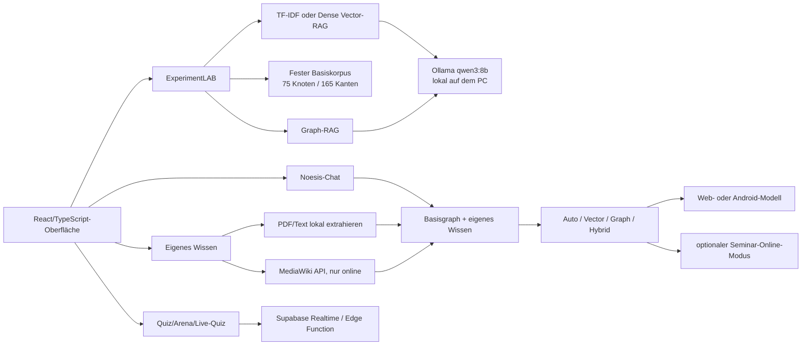

# Noesis – Technik- und Vortragsleitfaden

> **Stand:** 20. Juli 2026
>
> **Perspektive:** Ich schreibe als Student, der das Projekt iterativ im Chat mit Claude und ChatGPT aufgebaut, Teile selbst programmiert, jeden wichtigen Schritt geprüft und die Verantwortung für Versuchsdesign, Ausführung und Interpretation behalten hat.
>
> **Zweck:** Dieses Dokument ist mein technischer Spickzettel, meine ehrliche Projektdokumentation und ein ausformulierter Leitfaden für einen Vortrag von ungefähr 45 bis 60 Minuten.

## Aktueller Status des Hauptlaufs

| Feld | Wert |
|---|---|
| Run-ID | `run_mrsmtfho_e43f3c5f` |
| Umfang | 40 Fragen × 2 Bedingungen × 5 Wiederholungen = **400 Trials** |
| Bedingungen | Dense Vector-RAG und Graph-RAG |
| Generator | lokales Ollama-Modell `qwen3:8b` |
| Status in diesem Dokument | **vollständig beendet, exportiert und extern gegengeprüft** |

Der Lauf wurde mit **400 von 400 Trials ohne Laufzeitfehler** beendet. Die primäre Güteauswertung verwendet nicht die 200 Wiederholungs-Trials je Bedingung als scheinbar unabhängige Fälle, sondern die **40 einzigartigen Fragen**:

| Primärer Vergleich | Graph-RAG | Dense Vector-RAG |
|---|---:|---:|
| Korrekte Fragen | **37/40** | **30/40** |
| Accuracy | **92,5 %** | **75,0 %** |
| Wilson-Intervall | 80,1–97,4 % | 59,8–85,8 % |
| Median End-to-End, 200 Timing-Trials | 4.359,5 ms | 1.098,8 ms |
| Evidenz-Recall | 93,1 % | 49,3 % |

Im gepaarten Vergleich waren neun Fragen nur mit Graph-RAG korrekt und zwei nur mit Vector-RAG. Der exakte zweiseitige McNemar-Test ergibt **p = 0,0654**. Ich darf deshalb einen deutlichen **deskriptiven Vorteil von 17,5 Prozentpunkten** berichten, aber bei einem üblichen 5-Prozent-Niveau noch keinen statistisch abgesicherten allgemeinen Sieg von Graph-RAG behaupten. Gleichzeitig zeigt sich ein klarer Preis: Graph-RAG war in dieser Konfiguration ungefähr viermal langsamer und verwendete deutlich mehr Kontext.

Wichtige methodische Einschränkung: `temperature = 0` und der feste Modell-Seed `42` machen die fünf Wiederholungen nicht zu fünf unabhängigen Beobachtungen. Für Genauigkeitsaussagen bleibt die sinnvolle unabhängige Einheit zunächst die Frage, also **n = 40**, nicht n = 200 pro Bedingung. Die Wiederholungen untersuchen vor allem Laufzeit- und Ausführungsstabilität. Diese Einschränkung darf ich nicht durch eine große Trial-Zahl kaschieren.

---

## 1. Das Projekt in einem Satz

Ich untersuche, ob ein lokal laufendes Sprachmodell journalistisch oder wissensorientiert zuverlässiger antwortet, wenn ich ihm Zusatzwissen als semantisch ähnliche Textstücke (**Vector-RAG**) oder als explizite Knoten-und-Kanten-Struktur (**Graph-RAG**) bereitstelle – und ich habe aus diesem Experiment schrittweise die lokale Wissensanwendung **Noesis** gebaut.

Meine Leitfrage lautet:

> **Was verändert sich an Antwortqualität, Evidenzabdeckung und Laufzeit, wenn nur die Retrieval-Struktur wechselt, das lokale Sprachmodell und die Fragen aber gleich bleiben?**

Dabei sind zwei Produkte entstanden, die ich sauber auseinanderhalte:

1. **Das ExperimentLAB** ist die kontrollierte Messumgebung. Es friert Korpus, Fragen, Prompt, Modellparameter, Reihenfolge und Metriken möglichst weit ein.
2. **Noesis** ist der explorative Produktprototyp. Dort kann ich chatten, eigenes Wissen importieren, Wikipedia ergänzen, einen Wissensgraphen erkunden, Sprache nutzen und Quizformate ausprobieren.

Noesis demonstriert, was aus der Idee werden kann. Die Produktgimmicks sind aber **keine zusätzlichen Versuchsergebnisse**.

---

## 2. Die ehrliche Entstehungsgeschichte

### 2.1 Ausgangspunkt: Ich wollte zunächst nur Inhalte sammeln

Am Anfang stand kein Graph-RAG-Labor. Ich hatte einen kleinen Python-Webscraper geschrieben und wollte Informationen aus dem Web sammeln, ordnen und später von einem Modell beantworten lassen. Dieser frühe Scraper ist eine historische Vorstufe und nicht Bestandteil des heutigen Repositorys. Deshalb darf ich im Vortrag seine konkrete Funktionsweise nicht als reproduzierbaren Teil des aktuellen Codes ausgeben.

Der entscheidende Lernmoment war: **Mehr Text ist noch kein besseres Wissenssystem.** Ein Sprachmodell braucht eine Auswahlmechanik. Sonst wird der Kontext zu lang, relevante Beziehungen gehen unter und ich kann kaum nachvollziehen, warum eine Antwort zustande kam.

### 2.2 Der erste Richtungswechsel: vom Scraping zum Retrieval-Experiment

Aus der praktischen Frage „Wie gebe ich dem Modell Wissen?“ wurde eine empirische Frage:

- Reicht die semantische Ähnlichkeit einzelner Artikel?
- Hilft ein expliziter Wissensgraph besonders bei Fragen über mehrere Beziehungen?
- Bezahle ich die zusätzliche Struktur mit mehr Laufzeit oder schlechterem Recall?
- Wann ist die vermeintlich intelligentere Methode nur ein aufwendiger Umweg?

Damit verschob sich mein Projekt von einer Datensammlung zu einem Vergleich von Retrieval-Pipelines.

### 2.3 Die KI als Entwicklungswerkzeug

Ich habe Claude und ChatGPT in ihren normalen Chatoberflächen verwendet. Typische Schleifen waren:

1. Ich beschrieb ein Problem oder eine gewünschte Funktion.
2. Die KI schlug Architektur, Code oder Testfälle vor.
3. Ich führte den Code lokal aus.
4. Fehler, Screenshots und unplausible Ergebnisse gingen zurück in den Chat.
5. Ich entschied, was übernommen, verworfen oder umgebaut wurde.

Das war produktiv, aber nicht magisch. Die KI konnte sehr schnell Breite erzeugen: Oberfläche, Retrieval-Varianten, Export, PWA, Android, Supabase und Tests. Gleichzeitig erzeugte sie neue Integrationsprobleme, methodische Übertreibungen und Funktionen, die gut aussahen, ohne schon wissenschaftlich belastbar zu sein. Meine wichtigste Arbeit war daher nicht nur „Code schreiben“, sondern **prüfen, eingrenzen, priorisieren und ehrlich beschriften**.

### 2.4 Der zweite Richtungswechsel: aus dem Labor wird Noesis

Während des Experimentbaus entstand die Frage: Wie sähe dieselbe Technik als verständliche Anwendung aus? Daraus wurde Noesis – benannt nach dem philosophischen Begriff für geistiges Erfassen. Die App sollte nicht nur Antworten zeigen, sondern auch:

- sichtbar machen, welches Wissen benutzt wurde,
- eigenes Wissen lokal aufnehmen,
- thematische Verbindungen zeigen,
- Wikipedia kontrolliert ergänzen,
- offline nutzbar sein,
- auf Android mit einem echten lokalen Modell laufen,
- und im Seminar als gemeinsames Live-Erlebnis funktionieren.

Das erhöhte den Schauwert, aber auch den Umfang. Im Vortrag mache ich daraus keine glatte Erfolgsgeschichte. Gerade das Scheitern von WebGPU auf manchen Smartphones, abgeschnittene Antworten, unnatürliche Stimmen, falsche Kontextfortsetzungen und der Wechsel zum Desktop-Ollama-Labor sind wesentliche Teile der Erkenntnis.

---

## 3. Gesamtarchitektur: Was läuft wo?



Die wichtigste Trennlinie im Code befindet sich in [`app/src/App.tsx`](../app/src/App.tsx):

- Das Experiment erhält einen `ExperimentRunner(BASE_GRAPH)` und bleibt dadurch beim eingefrorenen Basiskorpus.
- Der Produktchat erhält einen `ExperimentRunner(mergedGraph(custom))` und darf das persönliche Wissen einbeziehen.

Damit kann ein importiertes PDF nicht unbemerkt den wissenschaftlichen Hauptlauf verändern. Diese Trennung ist eine zentrale Designentscheidung.

### Technologiestapel

| Ebene | Technik | Warum |
|---|---|---|
| UI | React, TypeScript, Vite | schnelle interaktive Einseiten-App, gute Testbarkeit |
| Retrieval | eigene TF-IDF-, Dense- und Graph-Implementierung | Bedingungen sind sichtbar und veränderbar statt Black Box |
| Dense Embeddings | `paraphrase-multilingual-MiniLM-L12-v2` | deutsch/multilingual, lokal im Browser, semantischer als Wortstämme |
| Desktop-LLM | Ollama + `qwen3:8b` | gleiche lokale Modellinstanz für alle Hauptbedingungen, reproduzierbare Parameter |
| Web/Mobil lokal | WebLLM, wllama oder native LiteRT-LM-Pipeline | mehrere Geräteklassen; native Android-CPU-Pfad als Ausweg aus WebGPU-Problemen |
| Speicherung | localStorage + IndexedDB | unmittelbare UI-Aktualität plus dauerhafte lokale Sicherung |
| PWA | Service Worker + Manifest | installierbare Web-App und App-Shell offline |
| Android | Capacitor + Kotlin-Plugin | echte APK und kontrollierte native lokale Inferenz |
| Gemeinsame Demo | Supabase Realtime + Edge Function | Raumbeitritt, QR-Code, Online-Modell ohne Secret im Browser |

---

## 4. Der eingefrorene Wissensraum

Der Basiskorpus liegt in [`app/src/data/graph.ts`](../app/src/data/graph.ts) und enthält aktuell **75 Knoten und 165 gerichtete Kanten**. Ein Knoten besitzt unter anderem Titel, Zusammenfassung, Aliasse und Community. Eine Kante verbindet Quelle, Relation und Ziel. Die gemeinsamen Typen stehen in [`app/src/data/types.ts`](../app/src/data/types.ts).

Beispielhaft denke ich nicht nur in Dokumenten, sondern in Tripeln:

```text
Knoten A --[Relation]--> Knoten B
```

Für Graph-RAG ist das entscheidend: Eine Antwort kann einen Pfad verfolgen, etwa von einer Person über ein Werk zu einem Konzept. Vector-RAG sieht dagegen hauptsächlich Textrepräsentationen der einzelnen Knoten und kennt die Kante nicht als eigenständige Information.

### Warum ein kuratierter Korpus?

Ein kleiner, fester Korpus ist methodisch weniger beeindruckend als das offene Web, aber besser kontrollierbar:

- Ich kenne die erwarteten Pfade.
- Ich kann unbeantwortbare Fragen definieren.
- Ich kann Evidenz-Recall und -Precision berechnen.
- Beide Retrieval-Verfahren erhalten exakt denselben Informationsbestand.
- Ergebnisse sind nicht davon abhängig, ob Wikipedia während des Laufs geändert wurde.

Die Kehrseite ist Kurationsbias: Ich habe den Raum so strukturiert, dass Beziehungen explizit vorhanden sind. Das kann Graph-RAG begünstigen. Ich untersuche daher keine universelle Überlegenheit, sondern das Verhalten in diesem konkreten, kuratierten Wissensraum.

---

## 5. Der Fragenkorpus

Die 40 Fragen liegen vollständig in [`app/src/data/questions.ts`](../app/src/data/questions.ts):

| Typ | Anzahl | Zweck |
|---|---:|---|
| Single-Hop | 10 | direkte Beziehung oder einzelner Fakt |
| 2-Hop | 14 | Verbindung über einen Zwischenknoten |
| 3-Hop | 8 | längere Beziehungskette |
| Vergleich | 4 | mehrere Entitäten gegenüberstellen |
| unbeantwortbar | 4 | Enthaltung statt Halluzination prüfen |
| **Gesamt** | **40** | |

Jede Frage besitzt:

- eine Goldantwort als Referenz,
- Pflichtbegriffe (`mustContain`),
- alternative akzeptable Begriffe (`anyOf`),
- einen Goldpfad (`goldPath`) für Evidenzmetriken,
- bei unbeantwortbaren Fällen `expectAbstain`.

Die automatische Bewertung prüft damit nicht sprachliche Eleganz, sondern definierte Inhaltsmerkmale. Das ist schnell und reproduzierbar, aber grob: Ein sachlich falscher Satz kann zufällig Schlüsselwörter enthalten, während eine gute Paraphrase einen Begriff verfehlen kann. Deshalb existiert zusätzlich die verblindete manuelle Bewertungsansicht in [`app/src/views/Rate.tsx`](../app/src/views/Rate.tsx). Da ich die Doppelblindbewertung vor dem Vortrag nicht mehr vollständig durchführen kann, kennzeichne ich den aktuellen Score als **explorative automatische Bewertung**.

---

## 6. Vector-RAG: zwei technisch verschiedene Varianten

### 6.1 TF-IDF als lexikalische Basislinie

[`VectorIndex`](../app/src/engine/vectorRag.ts) baut aus Titel und Zusammenfassung jedes Knotens einen TF-IDF-Vektor. Anfrage und Dokument werden über Wortstämme abgebildet; die Ähnlichkeit ist der Kosinus zwischen beiden Vektoren. Standardmäßig werden die vier besten Knoten zurückgegeben.

**Warum brauche ich diese Variante?**

Sie ist klein, transparent und vollständig lokal. Sie zeigt aber auch die Grenze lexikalischer Suche: Paraphrasen können semantisch gleich sein, ohne dieselben Wortstämme zu teilen.

### 6.2 Dense Vector-RAG als semantische Hauptvariante

[`loadDenseModel`, `DenseIndex` und `getDenseIndex`](../app/src/engine/embeddings.ts) verwenden das Modell `Xenova/paraphrase-multilingual-MiniLM-L12-v2` mit Transformers.js 3.8.1. Es wird int8 geladen, erzeugt normalisierte Mean-Pooling-Vektoren und vergleicht sie per Skalarprodukt. Weil die Vektoren normalisiert sind, entspricht das einer Kosinusähnlichkeit.

**Warum Dense im Hauptlauf?**

Die faire starke Alternative zu Graph-RAG ist nicht nur eine Wortstammsuche, sondern ein semantischer Retriever. Dense Vector-RAG kann auch Paraphrasen treffen. Erst wenn Graph-RAG gegen diese stärkere Basislinie antritt, ist der Vergleich interessant.

**Praktische Hürde:** Das Embedding-Modell ist ungefähr 120 MB groß. Beim ersten Laden braucht es Internet; danach wird es im Browsercache gehalten. Im Hauptlauf wird der komplette Dense-Index vor dem ersten Trial gebaut. Scheitert dieser Preflight, startet der Lauf nicht teilweise mit einer anderen Retrieval-Variante. Ein stiller TF-IDF-Fallback wäre wissenschaftlich unzulässig.

**Was Vector-RAG nicht kennt:** Es wählt Knoten nach Ähnlichkeit aus, nutzt aber keine Kanten als Traversierungsregel. Der Generator kann Beziehungen nur erkennen, wenn sie im ausgewählten Text bereits stehen.

---

## 7. Graph-RAG: Entitäten, Traversierung und relationeller Kontext

Die Kernlogik liegt in [`GraphIndex`](../app/src/engine/graphRag.ts).

### Schritt 1: Entitäten verknüpfen

`linkEntities` sucht normalisierte Titel und Aliasse in der Frage. Längere Treffer werden zuerst geprüft, damit ein spezifischer Name nicht durch einen kürzeren Teiltreffer verdrängt wird. Wenn keine Entität gefunden wird, dienen die zwei lexikalisch passendsten Knoten als Fallback-Startpunkte.

### Schritt 2: den Graphen durchsuchen

`extract` führt eine bewertete Traversierung aus. Die Standardeinstellungen sind:

```text
Tiefe: 3
Beam-Breite: 4
maximale Knoten: 14
```

Relationen und Zielbegriffe erhalten Bonuspunkte, und frühe Ebenen werden bevorzugt. Die Beam-Breite verhindert, dass der Kontext bei jedem ausgehenden Link exponentiell wächst.

### Schritt 3: Kontext serialisieren

Graph-RAG gibt dem Modell nicht nur Artikelzusammenfassungen, sondern explizite Relationstripel. Dadurch wird aus „diese Texte sind ähnlich“ die Aussage „dieser Knoten steht über diese Relation mit jenem Knoten in Verbindung“.

### Meine Hypothese

Ich erwarte den größten Vorteil bei 2-Hop- und 3-Hop-Fragen, weil die Kanten dort die Suche führen. Bei Single-Hop-Fragen könnte Dense Vector-RAG gleich gut oder schneller sein. Graph-RAG kann sogar verlieren, wenn die Entitätserkennung falsch startet oder die Beam-Suche einen relevanten Zweig abschneidet.

### Kein Beweis durch eine schöne Visualisierung

Der interaktive Graph zeigt die ausgewählten Knoten und Kanten. Er macht den Retrievalpfad nachvollziehbarer, beweist aber nicht, dass genau diese Kante die Modellantwort verursacht hat. Auch die Zuordnung einzelner Sätze zu Quellen in [`AnswerEvidence`](../app/src/components/AnswerEvidence.tsx) ist eine lexikalische Evidenzheuristik, keine Kausalanalyse.

---

## 8. Die Versuchsbedingungen

[`ExperimentRunner.prepare`](../app/src/engine/experiment.ts) implementiert sechs mögliche Bedingungen:

| Bedingung | Kontext | Wissenschaftliche Funktion |
|---|---|---|
| `baseline` | kein Retrieval-Kontext | Nutzen von Zusatzwissen insgesamt |
| `vector` | Top-k Vektortreffer | Standardvergleich |
| `graph` | Graphtraversierung + Relationstripel | zentrale Graph-RAG-Bedingung |
| `vector_budget` | mehr Vektortreffer bis ungefähr zum Graph-Zeichenbudget | prüft den Kontextmengen-Confound |
| `graph_no_edges` | graphisch ausgewählte Knoten, aber ohne serialisierte Kanten | prüft, ob Kanten selbst helfen |
| `hybrid` | Graphkontext plus zusätzliche Vektortreffer | explorativer Kombinationsansatz |

Der aktuelle Nachtlauf enthält aus Zeitgründen nur `vector` und `graph`. Deshalb kann er **nur den Pipelinevergleich** beantworten. Er kann weder den allgemeinen RAG-Nutzen gegenüber `baseline` noch den isolierten Effekt der Kanten oder des Kontextbudgets schlüssig belegen. Diese Kontrollen sind als Folgestudie oder separater Lauf vorgesehen.

Das ist eine wichtige ehrliche Korrektur gegenüber einer zu großen Erzählung: Ich darf bei diesem Lauf nicht sagen „Graphen helfen wegen der Kanten“, wenn ich `graph_no_edges` nicht mitgemessen habe.

---

## 9. Konstanter Generator: lokales Ollama

Der aktuelle Hauptlauf nutzt [`OllamaEngine`](../app/src/engine/ollama.ts). Die eingefrorenen Standardparameter sind:

```text
Endpoint:   http://127.0.0.1:11434
Modell:     qwen3:8b
temperature: 0
seed:       42
num_ctx:    4096
num_predict: 160
thinking:   aus
keep_alive: 30m
```

`inspectOllama` prüft Version und installierte Modelle über `/api/version` und `/api/tags`. `OllamaEngine.load` wärmt das Modell vor und erfasst Provenienz wie Modell-Digest, Laufzeit, Parameter, Quantisierung, Modellgröße und – soweit verfügbar – VRAM-Diagnostik. `generate` nutzt einen gestreamten `/api/chat`-Request; der Zeitpunkt des ersten Textfragments wird als TTFT erfasst. Ein Timeout nach 180 Sekunden verhindert endlos hängende Einzelanfragen.

### Warum dasselbe Modell in beiden Bedingungen?

Ich will Retrieval vergleichen, nicht Modellfamilien. Deshalb müssen Graph und Vector im selben Run denselben Generator, Prompt, Seed und dieselben Samplingparameter verwenden. Ein zusätzliches Modellvergleichsexperiment wäre interessant, ist aber eine andere Forschungsfrage.

### Warum nicht mehr das kleine Handy-Modell als Hauptgenerator?

Die ursprüngliche Idee zielte stärker auf Browser- und Smartphone-Modelle. In der Praxis scheiterte WebGPU auf einem Samsung S23+ mit einem Vulkan-Fehler, kleine Modelle formulierten merklich schlechter und der Browserkontext war knapp. Der ausführbare Hauptversuch wurde deshalb auf ein lokales Desktop-Modell umgestellt.

Das ist keine unsichtbare technische Reparatur, sondern eine **methodische Abweichung**: Der aktuelle Versuch untersucht Retrieval unter einem lokalen 8B-Desktopmodell. Er beantwortet nicht automatisch, ob dasselbe Ergebnis auf einem 0,6B-Handymodell gilt. Die Android-App ist ein Produktpilot, nicht die Messplattform des Hauptlaufs.

---

## 10. Prompt und Antwortbegrenzung

Der feste Systemprompt in [`app/src/engine/experiment.ts`](../app/src/engine/experiment.ts) verlangt eine präzise deutsche Antwort in höchstens drei Sätzen, ausschließlich aus dem bereitgestellten Kontext. Bei fehlender Evidenz soll das Modell explizit sagen, dass die Information nicht gesichert vorliegt.

Die Begrenzung hat drei Gründe:

1. Antworten werden vergleichbarer.
2. Laufzeit und Tokenmenge bleiben beherrschbar.
3. Halluzinationen bekommen weniger Raum.

Sie hat aber auch einen Preis: Ein früheres Problem waren Antworten, die mitten im Satz endeten. Im Produktchat prüft [`completeChatAnswer`](../app/src/engine/chatOutput.ts) deshalb auf einen vollständigen Satz und bevorzugt eine kürzere geschlossene Antwort. Das Experiment soll dagegen seine eingefrorenen Bedingungen nicht während des Laufs verändern.

---

## 11. Reihenfolge, Randomisierung und Checkpoint

### Versuchsplan

[`buildTrialSchedule`](../app/src/engine/experiment.ts) verwendet die Strategie

```text
seeded-question-shuffle+cyclic-condition-counterbalance-v1
```

Die Fragen werden mit einem festen Seed gemischt. Die Startbedingung rotiert zyklisch, damit eine Bedingung nicht systematisch zuerst oder erst nach langer Aufwärmzeit kommt. Der aktuelle Plan umfasst fünf Wiederholungen jedes Frage-Bedingungs-Paares.

### Warum ein Checkpoint nötig ist

400 lokale Generierungen können Stunden dauern. Ein Browserreload, ein leerer Akku oder ein Prozessabbruch darf nicht alle Ergebnisse vernichten. [`app/src/engine/experimentResume.ts`](../app/src/engine/experimentResume.ts) speichert daher einen Checkpoint der Version 2.

`experimentConfigFingerprint` bildet einen Fingerabdruck aus Modell, Digest, Runtime, Parametern, Retrieval, Bedingungen, Wiederholungen und Seed. `pendingTrials` setzt nur solche Kombinationen fort, die für genau diesen Run noch fehlen. Ändert sich eine zentrale Einstellung, entsteht nicht versehentlich ein gemischter Run.

### Wichtiger Fix

Der Lauf erzeugt Checkpoint und Run-ID **vor** dem rechenintensiven Preflight. So ist auch ein Abbruch beim Dense-Indexaufbau nachvollziehbar. Neue Ergebnisse werden mit einem funktionalen State-Update atomar an den aktuellen Stand angehängt, damit schnelle Updates keine Trials überschreiben.

---

## 12. Was genau wird gemessen?

Der Datentyp `TrialResult` in [`app/src/data/types.ts`](../app/src/data/types.ts) enthält unter anderem:

- Run-ID, Trial-ID, Frage, Kategorie und Wiederholung,
- Bedingung, Retrievalmodus und Engine,
- Reihenfolge und Seed,
- Modell- und Ausführungsprovenienz,
- Antwort und automatischen/manuellen Score,
- abgerufene Knoten,
- Evidenz-Recall und Evidenz-Precision,
- Kontextlänge,
- Retrieval-, Modell- und End-to-End-Zeit,
- Time to First Token, Ausgabetokens und Tokens pro Sekunde.

### Qualitätsmetriken

`autoScoreAnswer` in [`app/src/engine/experiment.ts`](../app/src/engine/experiment.ts) vergibt `korrekt`, `teilweise`, `falsch` oder `enthaltung`. `effectiveScore` nimmt eine manuelle Bewertung, wenn vorhanden, sonst die automatische.

`evidenceMetrics` berechnet:

```text
Evidenz-Recall    = gefundene Goldpfad-Knoten / Goldpfad-Knoten
Evidenz-Precision = gefundene Goldpfad-Knoten / alle abgerufenen Knoten
```

Damit kann ich unterscheiden:

- **Retrieverfehler:** Die nötige Evidenz wurde nicht gefunden.
- **Generatorfehler:** Die Evidenz war vorhanden, aber das Modell antwortete trotzdem falsch.

### Laufzeitmetriken

- **Retrievalzeit:** Zeit für Auswahl und Kontextaufbau.
- **TTFT:** Zeit bis zum ersten sichtbaren Token.
- **Modellzeit:** reine Generationsphase.
- **End-to-End:** gesamte Pipeline einschließlich Retrieval.
- **Tokens/s:** Generationsdurchsatz.

Für eine Live-Anwendung ist nicht nur der mittlere Wert wichtig. Median und Interquartilsabstand sind robuster gegen einzelne Ausreißer; p95 zeigt, wie schlecht ein langsamer Randfall werden kann.

---

## 13. Statistische Auswertung ohne Übertreibung

[`aggregate`](../app/src/engine/experiment.ts) aggregiert Bedingungswerte. [`pairedComparison`](../app/src/engine/experiment.ts) paart Ergebnisse derselben Run-ID, Frage, Wiederholung, Engine und Retrievalkonfiguration. Für binär korrekt/falsch wird ein exakter McNemar-Vergleich berechnet. Die Ergebnisansicht ergänzt Wilson-Konfidenzintervalle und Kategorieauswertungen in [`app/src/views/Results.tsx`](../app/src/views/Results.tsx).

### Was ich morgen sagen kann

- Alle Bedingungen beantworten dieselben 40 Fragen: der Vergleich ist gepaart.
- Fünf Wiederholungen liefern 200 Trials pro Bedingung, aber nicht 200 unabhängige Wissensfragen.
- Der korrekte vorsichtige Interpretationsfokus liegt auf den 40 Fragen.
- Laufzeitwiederholungen sind trotzdem nützlich, weil Systemlast und Inferenzzeit variieren können.
- Ein McNemar-p-Wert aus allen deterministischen Wiederholungszeilen wäre leicht zu selbstsicher. Ich zeige ihn höchstens explorativ und bespreche eine Aggregation auf Fragenebene beziehungsweise Sensitivitätsanalyse.
- Ohne abgeschlossene verblindete Bewertung bleibt die automatische Accuracy vorläufig.

### Was ich nicht sagen darf

- „Graph-RAG ist allgemein bewiesen besser.“
- „n = 200 unabhängige Fälle pro Methode.“
- „Die Kanten verursachen den Unterschied“, wenn `graph_no_edges` fehlt.
- „Doppelblind getestet“, wenn ich selbst System und Goldantworten kenne.
- „Vollständig offline“, wenn ein Modell noch nie heruntergeladen oder ein Online-Dienst aktiv war.

### Sinnvolle Ergebnistabelle nach dem Lauf

| Metrik | Dense Vector | Graph | Differenz Graph − Vector |
|---|---:|---:|---:|
| korrekte Fragen, n/40 | _offen_ | _offen_ | _offen_ |
| automatische Accuracy | _offen_ | _offen_ | _offen_ |
| Enthaltungsrate | _offen_ | _offen_ | _offen_ |
| Evidenz-Recall | _offen_ | _offen_ | _offen_ |
| Evidenz-Precision | _offen_ | _offen_ | _offen_ |
| Median E2E, IQR | _offen_ | _offen_ | _offen_ |
| Median TTFT, IQR | _offen_ | _offen_ | _offen_ |
| Median Tokens/s | _offen_ | _offen_ | _offen_ |

---

## 14. Speichern, Exportieren, Importieren und Analysieren

[`app/src/engine/store.ts`](../app/src/engine/store.ts) schreibt Ergebnisse und eigenes Wissen sofort in `localStorage` und spiegelt sie asynchron mit Zeitstempel in IndexedDB. Die Zeitstempel verhindern, dass ein älterer asynchroner Schreibvorgang einen neueren Zustand überschreibt.

Die Funktionen `exportResultsJson`, `exportSubmissionBundle` und `exportResultsCsv` erzeugen transportierbare Dateien. Der Import in [`app/src/engine/resultsImport.ts`](../app/src/engine/resultsImport.ts) akzeptiert JSON, Submission-Bundles und Semikolon-CSV, prüft Enums, Zahlenbereiche, bekannte Frage-IDs, Konflikte und Duplikate. Begrenzungen von 25 MB und 50.000 Zeilen verhindern versehentliche Extremimporte.

Damit kann ich den Nachtlauf auf dem PC vorbereiten, exportieren und morgen auf den Laptop importieren, ohne Ergebnisse per Hand zu übertragen.

### Analyseskript

Das zusätzliche Skript [`app/scripts/analyze-experiment-results.mjs`](../app/scripts/analyze-experiment-results.mjs) validiert einen Export und erzeugt für strikte Run-/Engine-/Retrieval-Kohorten:

- n, Accuracy und Enthaltungsrate,
- Evidenz-Recall und -Precision,
- Median und IQR für E2E, TTFT und Tokens/s,
- gepaarte Graph-minus-Vector-Differenzen,
- Warnungen zu deterministischen Wiederholungen und Pseudoreplikation.

Aufruf nach dem Export:

```powershell
cd app
node .\scripts\analyze-experiment-results.mjs "C:\Pfad\zum\export.json"
```

Die dazugehörigen Tests stehen in [`app/tests/experiment-analysis.test.mjs`](../app/tests/experiment-analysis.test.mjs).

---

## 15. Noesis: vom Experiment zum verständlichen Produkt

Der Produktchat befindet sich in [`app/src/views/Conversation.tsx`](../app/src/views/Conversation.tsx). Ich kann dort `Vector`, `Graph`, `Hybrid` oder `Auto` auswählen.

`resolveChatCondition` entscheidet im Automodus heuristisch:

- mindestens zwei erkannte Entitäten → Hybrid,
- relationale Fragestellung → Graph,
- sonst → Vector.

Der Chat zeigt Quellen, technischen Kontext und einen fokussierten Teilgraphen. Bei einem echten Anschlussbezug wird ein kompakter Gesprächsverlauf mitgegeben. [`conversationContext.ts`](../app/src/engine/conversationContext.ts) versucht dabei, scheinbare Pronomenbezüge nicht zu aggressiv zu interpretieren. Genau hier lag ein sichtbarer Fehler: Auf eine neue Frage zum Dortmunder Mathetower antwortete das Modell erneut über Einstein. Die Ursache war nicht „Dummheit“ des Modells allein, sondern ein falscher alter Kontext plus ein zu großzügiger Follow-up-Mechanismus.

Im Produkt darf Dense Retrieval sichtbar auf TF-IDF zurückfallen, wenn das Embedding-Modell nicht verfügbar ist. Im Experiment ist dieser Fallback verboten, weil er die Bedingung verändern würde.

### Arena

[`app/src/views/Arena.tsx`](../app/src/views/Arena.tsx) zeigt zwei Antworten nacheinander verblindet und enthüllt danach Bedingungen, Evidenzgraph und optional eine Kanten-Gegenprobe. Die Arena ist ein didaktisches Werkzeug: Das Publikum erlebt, dass eine überzeugend klingende Antwort nicht automatisch besser belegt ist. Arena-Entscheidungen sind keine Hauptstudienwerte.

### Interaktiver Graph

[`ForceGraph`](../app/src/components/ForceGraph.tsx) zeichnet den Graphen selbst auf einem Canvas. Er unterstützt:

- freies Verschieben der Ansicht,
- Zoom um die Cursorposition,
- Pinch-Zoom auf Touchgeräten,
- Knotenziehen,
- Fit und Reset,
- hervorgehobene Kanten,
- gestrichelte Darstellung heuristischer Kanten.

Der eigene Kraftsimulator verwendet für kleine Graphen eine quadratische Abstoßungsberechnung. Das ist bei deutlich größeren Wissensräumen ein Skalierungsrisiko.

---

## 16. Eigenes Wissen: Text und PDF werden lokal zu Graphwissen

### PDF-Auslesen

[`readPdfText`](../app/src/engine/pdf.ts) verwendet PDF.js lokal. Grenzen sind 30 MB, 80 Seiten und 140.000 Zeichen. Ein SHA-256-Fingerabdruck wird genutzt, wenn der Browserkontext sicher ist; andernfalls ist der Fallback ausdrücklich als schwächer gekennzeichnet.

Wichtig: Es gibt kein OCR. Ein reines Scan-PDF enthält für PDF.js häufig keinen brauchbaren Text. Komplexe Spaltenlayouts, Tabellen und Fußnoten können ebenfalls falsch geordnet werden.

### Vom Dokument zu Knoten

[`ingestPdfDocument`](../app/src/engine/ingest.ts) erzeugt einen Dokumentwurzelknoten und Abschnitts- beziehungsweise Chunkknoten. Jeder Chunk behält Seiten- und Zeichenprovenienz. Die Chunks werden nicht einfach nur in Dateireihenfolge miteinander verbunden.

Thematische Kanten entstehen in [`app/src/engine/knowledge.ts`](../app/src/engine/knowledge.ts):

- `inferTopicEdges` sucht gewichtete gemeinsame Top-Terme und erzeugt `teilt_thema_mit`.
- `inferSimilarityEdges` verwendet TF-IDF-Kosinus und erzeugt `thematisch_aehnlich`.
- `mentionEdges` in der Ingest-Pipeline erzeugt Verbindungen nur bei einer tatsächlich belegten exakten Entitätsnennung.

Provenienz, Schwellenwert, Score, gemeinsame Terme und Evidenzausschnitt werden gespeichert. Dennoch sind thematische Ähnlichkeitskanten **Heuristiken, keine Faktenrelationen**. Paraphrasen ohne gemeinsames Vokabular können übersehen werden.

[`applyKnowledgeImport`](../app/src/engine/store.ts) wendet Importdeltas quellenbezogen und idempotent an. Kollisionen, hängende Kanten und unbelegte Kanten werden nicht still übernommen.

### Wikipedia ergänzen

[`app/src/engine/personalWikipedia.ts`](../app/src/engine/personalWikipedia.ts) spricht direkt mit der offiziellen deutschen MediaWiki-API. Ein Pull ist bewusst begrenzt: höchstens drei Wurzelthemen, wenige Nachbarn, neun Seiten und 48 Relationseinträge pro Vorgang.

Eine Kante `mediawiki_verlinkt_auf` entsteht nur, wenn MediaWiki einen tatsächlichen Artikellink liefert. Gespeichert werden URL, Page-ID, Revision und Evidenz. Automatisches Wikipedia-Laden erkennt nur explizite bekannte Entitätsnamen; privater PDF-Rohtext wird nicht für eine versteckte Websuche gesendet.

Wikipedia benötigt beim Pull Internet. Danach bleibt das importierte Wissen lokal verfügbar. „Offlinefähig“ bedeutet also nicht, dass ich beliebige neue Wikipedia-Inhalte ohne vorherigen Download erhalten kann.

---

## 17. Sprache: natürlicher, aber nicht magisch

[`app/src/engine/liveVoice.ts`](../app/src/engine/liveVoice.ts) kapselt Browser Web Speech und das Android-Plugin `NoesisSpeech`. Der `TurnBasedVoiceController` besitzt Zustände wie Zuhören, Denken, Sprechen und Pausieren. Das ist ein abwechselndes Gespräch, kein echtes Full-Duplex-System wie ein permanenter Audio-Stream.

Für natürlichere deutsche Ausgabe kann [`app/src/engine/neuralVoice.ts`](../app/src/engine/neuralVoice.ts) die offene Piper-Stimme `de_DE-thorsten-medium` lokal laden. Sie ist ungefähr 100 MB groß und wird nach dem ersten Download lokal über ONNX/WASM synthetisiert. Ohne Piper hängt die Natürlichkeit stark von den auf dem Gerät installierten Stimmen ab.

Auf Android wird Offline-Spracherkennung bevorzugt, aber nicht auf jedem System garantiert. Ein Systemanbieter kann Audio trotzdem über seinen Dienst verarbeiten. Die App speichert selbst keine Audiodatei. Im streng offline geschalteten Webmodus wird cloudabhängige Browsererkennung blockiert.

---

## 18. Offline-Web-App und die Grenzen des Wortes „offline“

[`app/scripts/generate-sw.mjs`](../app/scripts/generate-sw.mjs) erzeugt einen buildabhängigen App-Shell-Cache. [`app/public/sw.js`](../app/public/sw.js) hält HTML, JavaScript, CSS und kleine Assets offline vor; große optionale Modell- und ONNX-Dateien werden erst bei Nutzung im Runtime-Cache gespeichert. Das Manifest steht in [`app/public/manifest.webmanifest`](../app/public/manifest.webmanifest).

Der Schalter „offline“ ist eine **Anwendungsrichtlinie**, keine Firewall. Ein belastbarer Offlinenachweis lautet:

1. App, Embeddings, Stimme und gewähltes Modell einmal vollständig laden.
2. Denselben Browser, dasselbe Profil und denselben Ursprung verwenden.
3. WLAN und mobile Daten beziehungsweise Flugmodus tatsächlich deaktivieren.
4. App neu öffnen und eine vorbereitete Frage erfolgreich beantworten.

Die Skripte [`app/VORTRAG_OFFLINE_VORBEREITEN.cmd`](../app/VORTRAG_OFFLINE_VORBEREITEN.cmd) und [`app/VORTRAG_OFFLINE_STARTEN.cmd`](../app/VORTRAG_OFFLINE_STARTEN.cmd) helfen bei einem festen lokalen Ursprung. Der Leitfaden [`VORTRAG_OFFLINE.md`](VORTRAG_OFFLINE.md) dokumentiert den Vortragsablauf.

---

## 19. Die echte Android-App

Die APK wird mit Capacitor gebaut. Die Konfiguration steht in [`app/capacitor.config.ts`](../app/capacitor.config.ts), App-ID `de.tudortmund.noesis`. Der native JavaScript-Adapter ist [`app/src/engine/nativeLlm.ts`](../app/src/engine/nativeLlm.ts).

Zwei Modellprofile sind vorgesehen:

| Modell | ungefährer Download | Rolle |
|---|---:|---|
| Gemma 3n E2B IT | 2.589 MB | höhere Qualität, benötigt mehr RAM |
| Qwen3 0.6B | 348 MB | Kompatibilitäts- und Geschwindigkeitsprofil |

Das Kotlin-Backend in [`NativeLlmManager.kt`](../app/android/app/src/main/java/de/tudortmund/noesis/NativeLlmManager.kt) nutzt LiteRT-LM 0.14 auf der CPU. Das umgeht den fehleranfälligen Vulkan/WebGPU-Compute-Pfad, der auf dem Samsung S23+ `VK_ERROR_UNKNOWN` erzeugte. Downloads sind fortsetzbar, werden gegen erwartete Größe und SHA-Hash geprüft und erst danach atomar als fertiges Modell abgelegt. Es wird jeweils nur eine Engine im Speicher gehalten.

Der Katalog mit unveränderlichen Modellrevisionen, Größen und Hashes liegt in [`ModelCatalog.kt`](../app/android/app/src/main/java/de/tudortmund/noesis/ModelCatalog.kt). Die Bridge liegt in [`NoesisNativeLlmPlugin.kt`](../app/android/app/src/main/java/de/tudortmund/noesis/NoesisNativeLlmPlugin.kt), die Sprache in [`NoesisSpeechPlugin.kt`](../app/android/app/src/main/java/de/tudortmund/noesis/NoesisSpeechPlugin.kt).

Das Modell ist bewusst nicht in der APK. Der erste Modelldownload braucht Internet und freien Speicher. Danach kann es lokal laufen. Ein erfolgreicher Build garantiert noch keine perfekte Leistung auf jedem Handy: RAM, Android-Version, thermische Drosselung und Herstelleranpassungen müssen auf physischen Geräten getestet werden.

Die Workflowdatei [`android-apk.yml`](../.github/workflows/android-apk.yml) baut und prüft die APK automatisiert.

---

## 20. Seminar-Online-Modus und Supabase

GitHub Pages kann statische Dateien ausliefern, aber kein geheimes Modelltoken sicher halten und keinen eigenen dauerhaften Realtime-Server bereitstellen. Deshalb ist der Seminar-Online-Modus eine separate optionale Ebene.

[`app/src/engine/seminarOnline.ts`](../app/src/engine/seminarOnline.ts) sendet an eine Supabase Edge Function nur:

- die Frage,
- maximal 5.000 Zeichen lokal ausgewählten Kontext,
- maximal 1.800 Zeichen kompakten Verlauf,
- Teilnehmer-ID, Raumcode und Text-/Sprachmodus.

Der Browser sendet weder den gesamten Wissensgraphen noch ein Secret. Die Edge Function in [`supabase/functions/seminar-chat/index.ts`](../supabase/functions/seminar-chat/index.ts) hält den Provider-Schlüssel serverseitig, erzwingt Raumablauf, Ursprungskontrolle und Rate Limits und streamt nur Textfragmente. Die Datenbankfunktion für atomare Limits steht in [`supabase/migrations/202607170001_seminar_rate_limits.sql`](../supabase/migrations/202607170001_seminar_rate_limits.sql).

Dieser Modus ist eine robuste Vortragsdemo für viele Smartphones, aber **nicht lokal und nicht Teil des Hauptversuchs**.

### Live-Quiz wie Kahoot

[`app/src/engine/liveQuiz.ts`](../app/src/engine/liveQuiz.ts) nutzt Supabase Realtime Broadcast. Bis zu 20 Teilnehmende treten über QR-Code und sechsstelligen Raumcode bei. Die Fragen sind leichtes Multiple Choice; nach der Auflösung zeigt die App Einordnung und Position im Wissensgraphen. Antworten werden gegen Hostzeit bewertet, Revisionsnummern und Sync-Nachrichten helfen bei Reconnects.

Das Quiz ist flüchtig im Hostspeicher. Lädt der Host neu, geht der Raum verloren. Es ist für ein Seminar, nicht für eine manipulationssichere öffentliche Prüfung. Die ausführliche Anleitung liegt in [`LIVE_QUIZ.md`](LIVE_QUIZ.md).

---

## 21. Fehler, Hürden und was ich daraus gelernt habe

| Hürde | Sichtbares Symptom | Ursache | Reaktion | KI-Nutzen / KI-Grenze |
|---|---|---|---|---|
| PowerShell Execution Policy | `npm.ps1` durfte nicht laufen | Windows blockierte Skript | `npm.cmd install` | KI diagnostizierte schnell; kein Projektfehler |
| Dense-Download gab HTML statt JSON | `Unexpected token '<'` | Modellresource/Route lieferte Fehlerseite | Fehlerbehandlung und expliziter Preflight | KI half beim Debugging; erste UI ließ falschen Zustand zu |
| Dense-Schalter nicht klickbar | UI wirkte defekt | Modellzustand und Bedienelement gekoppelt | Zustände getrennt und Ladepfad sichtbar gemacht | generierter UI-State musste praktisch getestet werden |
| WebGPU auf Samsung | `CreateComputePipelines ... VK_ERROR_UNKNOWN` | Dawn/Vulkan-Treiberpfad | native CPU-APK statt Vulkan-Pipeline | KI konnte Alternativen entwerfen, aber Hardware nicht simulieren |
| Kleine Qwen-Antworten | Sätze wirkten aneinandergereiht | kleines Modell, knapper Kontext/Output | Desktop `qwen3:8b` für Labor; Satzabschluss im Produkt | „bestes Modell“ hängt von Gerät und Ziel ab |
| Kontextgröße 2048 | Request überschritt Kontext | zu viel RAG-Kontext/Verlauf | Promptbudgets und kompakte Kontexte | mehr Retrieval ist nicht automatisch besser |
| Antwort brach ab | Text endete mitten im Satz | Tokenlimit | `completeChatAnswer`, kompakter Prompt | KI-generierter Output braucht Nachbearbeitung |
| Einstein-Antwort auf Mathetower-Frage | alte Antwort wiederholt | falsche Follow-up-Erkennung/alter Kontext | strengere Gesprächskontextlogik | ein plausibler Chat kann semantisch völlig falsch routen |
| unnatürliche Handy-Stimme | roboterhafte TTS | gerätespezifische Systemstimme | Piper optional lokal, Sprecherwahl | KI-Code kann fehlende Sprachmodelle des Geräts nicht ersetzen |
| Tabwechsel während Lauf | Sorge vor Abbruch | UI-Navigation kann Komponenten wechseln | globaler Laufzustand, Checkpoint, Wiederaufnahme | lang laufende UI braucht Lebenszyklusdesign |
| Ergebnisübertragung | Hauptlauf am PC, Vortrag am Laptop | lokale Speicherung ist gerätegebunden | validierter Export/Import | portability muss explizit entworfen werden |
| Funktionswachstum | immer neue Gimmicks | Produktidee verdrängte Versuchsfrage | Labor und Produkt getrennt | KI ist sehr gut im Erweitern, nicht automatisch im Begrenzen |

Mein ehrliches Muster: Die KI war besonders stark beim Erzeugen von Varianten, Boilerplate, Fehlermeldungsanalyse und Testideen. Sie war schwächer bei Scope-Kontrolle, empirischer Gültigkeit, Hardwaregarantien und der Entscheidung, welche Funktion wirklich zur Forschungsfrage gehört.

---

## 22. Was ist tatsächlich geprüft – und was nicht?

Ein erfolgreicher automatischer Audit kann TypeScript-Kompilation, Unit-Tests, Produktionsbuild, Service-Worker-Erzeugung und Abhängigkeitsprüfung abdecken. Er beweist nicht:

- dass ein stundenlanger 400-Trial-Lauf sicher beendet ist,
- dass jedes physische Androidgerät genügend RAM besitzt,
- dass Supabase, Wikipedia oder ein Modellprovider morgen erreichbar sind,
- dass automatische Scores inhaltlich mit menschlichen Urteilen übereinstimmen,
- dass das System „keine Bugs“ besitzt.

Ich formuliere deshalb: „Der zuletzt ausgeführte Test- und Build-Audit war grün“, nicht „Die App ist fehlerfrei“.

### Reproduzierbarer technischer Audit

```powershell
cd app
npm.cmd test
npm.cmd run build
npm.cmd audit --omit=dev
```

Für das lokale Labor nutze ich [`app/NOESIS_LAB_STARTEN.cmd`](../app/NOESIS_LAB_STARTEN.cmd). Das Skript prüft Node, npm, Ollama und Modell, setzt lokale Laufzeitparameter, baut die App und öffnet den festen Ursprung `http://localhost:4173/?lab=1`.

---

## 23. Ehrliche Bewertung der KI-Leistung

### 23.1 Wie gut hat KI den Versuch konzipiert?

**Stärken:**

- Sie half, aus einer vagen App-Idee messbare Bedingungen zu machen.
- Sie schlug Goldpfade, unbeantwortbare Fragen, Evidenzmetriken, Counterbalancing und gepaarte Vergleiche vor.
- Sie machte zusätzliche Kontrollbedingungen wie `vector_budget` und `graph_no_edges` sichtbar.
- Sie half, technische Provenienz und Wiederaufnahme nicht zu vergessen.

**Schwächen:**

- Die Versuchserzählung wuchs schneller als die tatsächlich ausgeführten Bedingungen.
- Die große Trial-Zahl kann fälschlich nach großer statistischer Stichprobe aussehen.
- Der automatische Keyword-Score ist nur ein Proxy.
- Der Wechsel von Handymodell zu Desktopmodell verändert die ursprüngliche Forschungsfrage.
- Korpus und Fragen stammen aus derselben Entwicklungsumgebung und sind nicht unabhängig extern validiert.

Mein Urteil: **KI war ein sehr guter methodischer Sparringspartner, aber kein autonomer Versuchsleiter.** Ich musste Forschungsfrage, Einheiten, Kontrollen und Grenzen selbst zusammenhalten.

### 23.2 Wie gut hat KI Graph-RAG und Vector-RAG technisch umgesetzt?

**Technisch stark:**

- klar getrennte Retriever mit gemeinsamem Generator,
- echte relationale Serialisierung im Graphpfad,
- semantisches lokales Dense-Modell,
- Preflight statt stiller Bedingungsänderung,
- Evidenz- und Laufzeittelemetrie,
- Checkpoint, Provenienz und validierter Import/Export,
- sichtbare Quellen und Subgraphen.

**Technisch begrenzt:**

- Entitätslinking ist regelbasiert und kann Namen übersehen.
- Graphsuche ist heuristische Beam-Traversierung, kein gelerntes Graph-Retrievermodell.
- der Korpus ist klein und kuratiert,
- thematische Kanten für eigenes Wissen sind lexikalische Heuristiken,
- die Visualisierung skaliert nicht beliebig,
- Produkt- und Experimentumfang erzeugen Wartungsrisiko.

Mein Urteil: **Für ein studentisches Proseminar ist es ein ungewöhnlich vollständiger, transparent prüfbarer Prototyp. Für eine wissenschaftliche Publikation fehlen externe Daten, menschliche Annotation, stärkere Baselines, Ablationen und Geräte-/Modellreplikationen.**

### 23.3 Was habe ich selbst gemacht?

Eine ehrliche Formulierung für den Vortrag:

> „Ich hatte die Ausgangsidee, schrieb frühe Teile wie den Python-Scrapingansatz selbst, definierte die Richtung des Experiments, führte alle Schritte lokal aus, prüfte Fehler und entschied über Übernahmen. Claude und ChatGPT erzeugten und überarbeiteten große Teile von Architektur, TypeScript/Kotlin-Code, Tests, Dokumentation und Präsentationsentwürfen in einer iterativen Chat-Schleife. Ich behaupte deshalb nicht, jede Codezeile allein geschrieben zu haben; meine Eigenleistung liegt auch in Problemformulierung, Integration, Prüfung, Auswahl und kritischer Reflexion.“

---

## 24. Vortragserzählung für 52 Minuten

Die folgenden Notizen sind kein vorzulesendes Manuskript. Sie sind mein roter Faden. Jede Station endet mit einer Überleitung.

### 0:00–4:00 – Hook: Das System antwortet überzeugend falsch

**Auf der Folie:** Screenshot der Einstein/Mathetower-Verwechslung oder der Vulkan-Fehlermeldung.

**Ich sage:**

„Diese Antwort sieht flüssig aus – sie beantwortet nur nicht meine Frage. Genau das ist der Kern meines Projekts. Ich wollte nicht einfach einen Chatbot bauen, sondern sehen, was zwischen Frage, Wissen und Antwort passiert. Kann ich einem lokalen Modell Wissen so geben, dass es nicht nur gut klingt, sondern nachvollziehbar richtig liegt? Und kann KI mir helfen, dieses ganze Experiment zu bauen?“

Ich erkläre kurz, dass Scheitern kein peinlicher Ausrutscher, sondern Datenpunkt der Entwicklungsreise ist.

**Überleitung:** „Um zu verstehen, warum ich überhaupt bei Wissensgraphen gelandet bin, muss ich zum deutlich kleineren Anfang zurück.“

### 4:00–8:00 – Der unspektakuläre Anfang: ein Python-Scraper

**Auf der Folie:** vereinfachtes historisches Scraper-Snippet, deutlich als Rekonstruktion markieren.

**Ich sage:**

„Am Anfang wollte ich Webseiten sammeln. Ich hatte Teile eines Python-Scrapers selbst geschrieben. Doch ein Ordner voller Text beantwortet keine Frage. Ich musste auswählen, welcher Ausschnitt relevant ist. Hier wurde aus Webscraping Retrieval.“

Ich kennzeichne, dass der historische Scraper nicht im aktuellen Repository liegt und keine heutige reproduzierbare Komponente ist.

**Überleitung:** „Damit hatte ich plötzlich nicht mehr nur eine Bauaufgabe, sondern eine vergleichbare Forschungsfrage.“

### 8:00–15:00 – Theorie: LLM, RAG, Vector und Graph

**Auf der Folie:** dieselbe Frage fließt einmal durch Vector-RAG, einmal durch Graph-RAG.

**Ich sage:**

„Das Sprachmodell bleibt gleich. Nur der Bibliothekar wechselt. Vector-RAG sucht semantisch ähnliche Karteikarten. Graph-RAG beginnt bei erkannten Entitäten und folgt Beziehungen. Das Modell sieht anschließend den jeweils ausgewählten Kontext.“

Ich erkläre TF-IDF kurz als Wortstammbasislinie und Dense MiniLM als semantische Hauptvariante. Dann formuliere ich die Hypothese: Graphvorteil eher bei Multi-Hop, Vectorvorteil möglicherweise bei direkten Fragen und Geschwindigkeit.

**Publikumsfrage:** „Welche Methode würden Sie bei der Frage nach einer Beziehung über drei Stationen erwarten?“

**Überleitung:** „Um diese Vermutung überhaupt prüfbar zu machen, brauchte ich einen Wissensraum mit bekannten Wegen.“

### 15:00–20:00 – Der Korpus und die 40 Fragen

**Auf der Folie:** 75 Knoten, 165 Kanten; Tortendiagramm oder fünf Fragekategorien.

**Ich sage:**

„Ich habe mich gegen das offene Web im Hauptlauf entschieden. Das macht den Versuch kleiner, aber kontrollierbarer. Für jede Frage kenne ich Goldantwort und Goldpfad. Vier Fragen sind absichtlich unbeantwortbar. Eine gute KI muss manchmal nicht antworten.“

Ich erkläre Kurationsbias offen: Der Graph wurde für Beziehungen gebaut und könnte Graph-RAG strukturell bevorzugen.

**Überleitung:** „Nun musste ich sicherstellen, dass wirklich nur der Retrievalweg wechselt.“

### 20:00–27:00 – Technische Pipeline und Code

**Auf der Folie:** Architekturdiagramm und drei kurze Codeorte.

**Ich sage:**

„`ExperimentRunner.prepare` baut den Kontext, `OllamaEngine.generate` erzeugt die Antwort und `evidenceMetrics` prüft, ob der Goldpfad im Kontext lag. Das Experiment verwendet immer `BASE_GRAPH`; mein persönliches PDF-Wissen bleibt im Produktchat.“

Codepunkte, die ich öffnen kann:

- [`app/src/engine/vectorRag.ts`](../app/src/engine/vectorRag.ts) – TF-IDF und Top-k.
- [`app/src/engine/embeddings.ts`](../app/src/engine/embeddings.ts) – Dense MiniLM.
- [`app/src/engine/graphRag.ts`](../app/src/engine/graphRag.ts) – Entitätslinking und Traversierung.
- [`app/src/engine/experiment.ts`](../app/src/engine/experiment.ts) – gemeinsame Bedingungen, Scheduling und Metriken.

**Überleitung:** „Ein fairer Vergleich ist aber mehr als zwei Buttons.“

### 27:00–33:00 – Versuchsaufbau und Statistik

**Auf der Folie:** 40 × 2 × 5 = 400; Counterbalancing; Messgrößen.

**Ich sage:**

„Der aktuelle Run vergleicht Dense Vector gegen Graph unter demselben Qwen3:8b, Temperatur null und Seed 42. Die Reihenfolge ist seedbasiert gemischt und zyklisch ausbalanciert. Ich messe nicht nur Accuracy, sondern auch Evidenz und Geschwindigkeit.“

Dann der zentrale Ehrlichkeitssatz:

„400 Trials sind nicht 400 unabhängige Wissensfälle. Für Genauigkeit habe ich 40 Fragen. Die fünf deterministischen Wiederholungen sind hauptsächlich Stabilitäts- und Zeitmessungen.“

Ich erwähne außerdem: automatische Bewertung explorativ, keine abgeschlossene Doppelblindtestung, nur zwei Bedingungen im aktuellen Lauf.

**Überleitung:** „Und dann traf der saubere Versuchsplan auf reale Geräte.“

### 33:00–40:00 – Was schiefging

**Auf der Folie:** drei Karten: WebGPU/Vulkan, falscher Gesprächskontext, abgeschnittener Satz.

**Ich sage:**

„Die KI konnte mir Code für ein lokales Handymodell geben. Sie konnte aber nicht garantieren, dass Samsungs Vulkanpfad funktioniert. Der Browserdownload lief, die Compute-Pipeline nicht. Kleine Modelle waren langsam oder sprachlich schwach. Der Chat verwechselte Anschlussfrage und neues Thema. Mehr Kontext führte sogar zu Kontextfehlern.“

Ich zeige jeweils Problem → Diagnose → Änderung → verbleibende Grenze. Der Wechsel zu Ollama ist Teil der Methode, nicht nur Komfort.

**Überleitung:** „Aus diesen Reparaturen wurde mehr als ein Experiment – ein Prototyp, der seine Wissenswege sichtbar machen soll.“

### 40:00–47:00 – Noesis als Produktprototyp

**Auf der Folie:** Chat, persönlicher Wissensgraph, PDF/Wikipedia, Sprache, Arena.

**Ich sage:**

„Noesis lässt mich Retrieval auswählen und zeigt Quellen und Subgraph. Eigene PDFs werden lokal extrahiert. Thematische Kanten sind sichtbar als Heuristik markiert. Wikipedia-Kanten entstehen nur aus echten MediaWiki-Links. Für Android existiert ein nativer CPU-Pfad; für 20 Seminarhandys ein optionaler Supabase-Modus.“

Ich trenne dabei streng:

- lokale Produktfunktionen,
- online ergänzbare Funktionen,
- Gimmicks,
- wissenschaftliche Messung.

**Überleitung:** „Die eigentliche Seminarfrage ist nun nicht nur, ob Noesis funktioniert, sondern wie viel davon die KI wirklich leisten konnte.“

### 47:00–52:00 – Reflexion und Schluss

**Auf der Folie:** Zweispaltig „KI beschleunigte“ / „Ich musste verantworten“.

**Ich sage:**

„KI beschleunigte Architektur, Varianten, Fehleranalyse, Tests und Oberfläche enorm. Genau diese Geschwindigkeit erzeugte aber Scope Creep. Methodische Gültigkeit, Hardwaregrenzen und ehrliche Claims musste ich selbst nachziehen. Mein Ergebnis ist daher kein Beweis, dass ChatGPT die Arbeit übernimmt. Es zeigt eher: KI verschiebt die Arbeit vom Tippen zum Spezifizieren, Prüfen und Begrenzen.“

Schlusssatz:

> „Die interessanteste Leistung dieses Projekts ist nicht, dass eine KI einen Chatbot gebaut hat. Es ist, dass ich jeden Wissensweg – und auch jeden Umweg – sichtbar machen musste.“

### 52:00–60:00 – Fragen oder Reserve

Bei 45 Minuten kürze ich:

- Entstehung um zwei Minuten,
- Theorieteil um zwei Minuten,
- Produktgimmicks auf drei Funktionen,
- Live-Demo auf einen vorbereiteten Pfad,
- Detailstatistik in die Fragerunde.

---

## 25. Demo-Drehbuch

### Hauptdemo, vollständig lokal vorbereitet

1. ExperimentLAB öffnen und aktuelle Run-ID beziehungsweise Ergebnisimport zeigen.
2. Eine Dense- und eine Graph-Antwort derselben Frage nebeneinander vergleichen.
3. Evidenz-Recall und Retrievalpfad zeigen.
4. In Noesis eine vorbereitete Frage stellen.
5. „Antwort im Graph nachvollziehen“ öffnen.
6. Einen kleinen Text – nicht erst ein großes PDF – importieren und neue thematische Kante zeigen.

### Nur wenn Internet sicher ist

7. Einen vorbereiteten Wikipedia-Artikel pullen.
8. Live-Quiz-Raum öffnen, QR-Code zeigen, höchstens eine Proberunde.
9. Optional Seminar-Online-Modus für fremde Handys.

### Was ich nicht live herunterlade

- kein 8B-Modell,
- kein Androidmodell,
- kein Dense-Embeddingmodell,
- keine Piper-Stimme,
- keine frische APK.

Alle großen Downloads müssen vorher im exakt selben Profil und Ursprung geladen sein.

---

## 26. Notfallplan

| Problem morgen | Sofortreaktion | Was ich dazu sage |
|---|---|---|
| 400er Lauf noch nicht fertig | Checkpoint sichern, Zwischenstand exportieren, keine Endwerte behaupten | „Der Run läuft; ich zeige Design und vorläufigen Status, nicht das Resultat.“ |
| Ollama nicht erreichbar | `NOESIS_LAB_STARTEN.cmd`, `ollama list`, `ollama serve` prüfen | „Der Generator ist ein lokaler Dienst; die Daten sind nicht verloren.“ |
| Dense-Modell fehlt | Lauf nicht still auf TF-IDF umstellen; vorbereiteten Export zeigen | „Ein Fallback würde die Bedingung verändern.“ |
| Browser neu geladen | Checkpoint fortsetzen | „Jede fertige Kombination bleibt gespeichert.“ |
| Laptop hat keine Ergebnisse | validierten JSON-/Bundle-Export importieren | „Versuch und Präsentationsgerät sind bewusst entkoppelt.“ |
| Internet weg | lokale Hauptdemo und lokales Quiz verwenden | „Wikipedia, Supabase und Modelldownload sind optionale Onlinepfade.“ |
| Supabase fällt aus | Screenshot/Video oder lokales Quiz | „Der Realtime-Dienst ist ein Gimmick, nicht mein Ergebnis.“ |
| Stimme klingt schlecht | Textmodus | „Sprachqualität ist geräteabhängig und keine Forschungsmetrik.“ |
| APK/Modell startet nicht | Desktop-Noesis zeigen, Smartphoneproblem als Hürde erklären | „Der native Pfad ist Pilot, nicht Hauptmessung.“ |
| Ergebnisse widersprechen Hypothese | genau so zeigen; Evidenzdiagnose nach Kategorie | „Eine Hypothese darf scheitern.“ |
| einzelne Antworten sind absurd | Retrieverkontext, Goldpfad und Score gemeinsam öffnen | „Der Fehler ist analytisch interessanter als eine glatt klingende Demo.“ |

---

## 27. Wahrscheinliche Prüferfragen und belastbare Antworten

### „Warum überhaupt Graph-RAG?“

Weil manche Fragen nicht durch einen einzelnen ähnlichen Text, sondern über explizite Beziehungen beantwortet werden. Mein Graph macht diese Wege mess- und visualisierbar. Ob das praktisch besser ist, soll gerade nicht vorausgesetzt werden.

### „Warum Dense MiniLM und nicht nur TF-IDF?“

TF-IDF ist eine transparente lexikalische Basislinie, aber paraphrasenschwach. Dense MiniLM ist eine stärkere semantische Vergleichsbedingung. Der Hauptlauf nutzt deshalb Dense.

### „Ist der Graph nicht zugunsten von Graph-RAG gebaut?“

Ja, Kurationsbias ist möglich. Der Graph enthält explizite Relationen und die Fragen nutzen bekannte Pfade. Deshalb generalisiere ich nicht auf beliebige Korpora. Eine Folgestudie bräuchte externen Korpus und extern erstellte Fragen.

### „Warum sind 400 Trials nicht n = 400?“

Weil dieselben 40 Fragen unter weitgehend deterministischen Einstellungen wiederholt werden. Für Wissensgenauigkeit ist die Frage die sinnvolle unabhängige Einheit. Die Wiederholungen messen vor allem Timing und Ausführungsstabilität.

### „Warum Seed 42 und Temperatur null?“

Ich wollte Generationsvarianz reduzieren, damit der Retrievalunterschied nicht von Samplingrauschen überdeckt wird. Dafür verliere ich die Möglichkeit, Antwortvarianz als unabhängige Stichprobe zu behandeln.

### „Ist der Kontextumfang fair?“

Im aktuellen Graph-vs-Vector-Lauf kann die Kontextmenge differieren. Dafür existiert `vector_budget`, wurde aber im aktuellen Nachtlauf nicht mitgemessen. Der Budget-Confound bleibt daher eine Grenze.

### „Beweisen bessere Graphwerte, dass Kanten helfen?“

Nein. Dafür ist die Ablation `graph_no_edges` nötig. Der aktuelle Zweibedingungslauf vergleicht komplette Pipelines.

### „Warum keine Doppelblindtestung?“

Die App besitzt eine verblindete A/B-Ansicht und Kappa-Berechnung, aber die vollständige unabhängige Doppelbewertung konnte ich zeitlich nicht abschließen. Ich kennzeichne aktuelle Scores daher als automatisch und explorativ.

### „Was ist eine Enthaltung?“

Bei einer unbeantwortbaren Frage soll das Modell ausdrücklich fehlende gesicherte Information benennen. Das ist keine Schwäche, sondern gewünschtes Verhalten gegen Halluzination.

### „Was sagt Evidenz-Recall zusätzlich zur Accuracy?“

Er zeigt, ob der Retriever die erwarteten Goldpfad-Knoten überhaupt geliefert hat. Hoher Recall plus falsche Antwort deutet eher auf den Generator; niedriger Recall auf Retrieval.

### „Ist Noesis wirklich offline?“

Die App-Shell und bereits geladene lokale Modelle können offline laufen. Erster Modelldownload, neue Wikipedia-Pulls, Supabase und gegebenenfalls System-Spracherkennung benötigen Netz. Der UI-Toggle allein ist keine Firewall.

### „Warum lief das Handymodell nicht?“

Der WebGPU-Pfad scheiterte auf dem konkreten Vulkan-Treiber. Deshalb wurde ein nativer CPU-Pfad über LiteRT-LM entworfen. Das HauptExperiment läuft reproduzierbarer über Ollama auf dem PC.

### „Kann man Desktop- und Mobilergebnisse vergleichen?“

Nicht direkt. Modellgröße, Runtime, Kontextbudget und Hardware unterscheiden sich. Android ist ein Produktpilot; der aktuelle Hauptlauf ist Desktopretrieval mit demselben 8B-Generator.

### „Werden private PDFs an Supabase geschickt?“

Standardmäßig nein. Der Produktchat filtert private Wissensquellen für den Seminar-Online-Modus heraus; eine Freigabe müsste explizit erfolgen. Der Edge-Request ist zusätzlich begrenzt. Wikipedia ist ein separater opt-in Onlinevorgang.

### „Ist der Supabase-Schlüssel nicht öffentlich?“

Der veröffentlichbare Client-Key darf im Browser stehen. Ein Provider-Secret liegt nur in der Edge Function. Raumablauf, Ursprungskontrolle und Rate Limits reduzieren Missbrauch, ersetzen aber keine Hochsicherheitsarchitektur.

### „Sind Wikipedia-Kanten erfunden?“

Relationale Wikipedia-Kanten entstehen nur aus tatsächlichen MediaWiki-Artikellinks und speichern URL, Seite und Revision. Thematische Kanten aus eigenen PDFs sind dagegen ausdrücklich als Heuristiken markiert.

### „Warum kein OCR?“

OCR hätte zusätzliche Modelle, Sprache, Layoutrekonstruktion und Fehlerklassen eingeführt. Für den Prototyp unterstütze ich textbasierte PDFs und benenne Scan-PDFs als Grenze.

### „Hat die KI alles gemacht?“

Nein. Sie hat große Teile von Code, Tests und Entwürfen erzeugt oder überarbeitet. Ich habe Ausgangsidee, einzelne frühe Codeteile, Aufgabenformulierung, lokale Ausführung, Fehlersuche, Auswahl, Integration und wissenschaftliche Verantwortung übernommen. Gerade das Prüfen der KI ist Teil der Leistung.

### „Ist das Projekt jetzt fehlerfrei?“

Das kann seriös niemand garantieren. Ich kann grüne Tests und Builds, konkrete Sicherheitsprüfungen und bekannte Grenzen nennen. Langläufe, reale Geräte und externe Dienste bleiben empirisch zu testen.

### „Was wäre der nächste wissenschaftliche Schritt?“

Ein präregistriertes, extern validiertes Fragenset; unabhängige verblindete Bewerter; `baseline`, `vector_budget` und `graph_no_edges`; mehrere Korpora; mehrere lokale Modelle; Fragenebenenanalyse und Hardwareprotokoll.

---

## 28. Checkliste für den Morgen

### Ergebnisse sichern

- [ ] Prüfen, ob `run_mrsmtfho_e43f3c5f` vollständig 400 Trials enthält.
- [ ] JSON, CSV und Submission-Bundle exportieren.
- [ ] Dateien zusätzlich auf USB-Stick oder Cloud ablegen.
- [ ] Analyseskript auf den JSON-Export anwenden.
- [ ] Nur echte Werte in Tabelle und Folien eintragen.
- [ ] Anzahl eindeutiger Fragen und Anzahl Trials getrennt berichten.
- [ ] Fehlende beziehungsweise doppelte Paare prüfen.

### Laptop vorbereiten

- [ ] Repository und `node_modules` beziehungsweise frischen `npm.cmd install`-Stand vorhanden.
- [ ] Ollama installiert und `qwen3:8b` lokal sichtbar.
- [ ] Dense-Modell im verwendeten Browserprofil geladen.
- [ ] Ergebnisexport importiert und gefiltert.
- [ ] lokale App einmal neu gestartet.
- [ ] Flugmodusprobe mit vorbereitetem lokalen Pfad.
- [ ] Netzteil, HDMI/USB-C-Adapter, Maus und Ladegerät einpacken.
- [ ] Screenshots oder Bildschirmaufnahme der zentralen Demo bereithalten.
- [ ] QR-Code nur zeigen, wenn Supabase-Raum getestet ist.

### Methodische Formulierungen

- [ ] „Pipelinevergleich“, nicht „isolierter Kanteneffekt“.
- [ ] „40 unabhängige Fragen“, nicht „200 unabhängige Fälle je Bedingung“.
- [ ] „automatische explorative Bewertung“, nicht „doppelblind“.
- [ ] „lokal nach vorherigem Download“, nicht pauschal „immer offline“.
- [ ] „letzter Audit grün“, nicht „bugfrei“.

---

## 29. Code-Landkarte: Wo finde ich was?

| Frage | Codeort |
|---|---|
| Wo sind Basisknoten und -kanten? | [`app/src/data/graph.ts`](../app/src/data/graph.ts) |
| Wo sind die 40 Goldfragen? | [`app/src/data/questions.ts`](../app/src/data/questions.ts) |
| Wo stehen Ergebnis- und Graph-Typen? | [`app/src/data/types.ts`](../app/src/data/types.ts) |
| Wo wird TF-IDF-Retrieval gebaut? | [`app/src/engine/vectorRag.ts`](../app/src/engine/vectorRag.ts) |
| Wo werden Dense Embeddings geladen? | [`app/src/engine/embeddings.ts`](../app/src/engine/embeddings.ts) |
| Wo läuft die Graphtraversierung? | [`app/src/engine/graphRag.ts`](../app/src/engine/graphRag.ts) |
| Wo werden Bedingungen und Schedule definiert? | [`app/src/engine/experiment.ts`](../app/src/engine/experiment.ts) |
| Wo wird Ollama geprüft und gemessen? | [`app/src/engine/ollama.ts`](../app/src/engine/ollama.ts) |
| Wo wird ein Lauf fortgesetzt? | [`app/src/engine/experimentResume.ts`](../app/src/engine/experimentResume.ts) |
| Wo startet die Experimentoberfläche? | [`app/src/views/Experiment.tsx`](../app/src/views/Experiment.tsx) |
| Wo werden Scores manuell bewertet? | [`app/src/views/Rate.tsx`](../app/src/views/Rate.tsx) |
| Wo werden Resultate aggregiert/importiert? | [`app/src/views/Results.tsx`](../app/src/views/Results.tsx) |
| Wo liegen Speicherung und Exporte? | [`app/src/engine/store.ts`](../app/src/engine/store.ts) |
| Wo wird der Import validiert? | [`app/src/engine/resultsImport.ts`](../app/src/engine/resultsImport.ts) |
| Wo liegt das externe Analyseskript? | [`app/scripts/analyze-experiment-results.mjs`](../app/scripts/analyze-experiment-results.mjs) |
| Wo wird der Noesis-Chat orchestriert? | [`app/src/views/Conversation.tsx`](../app/src/views/Conversation.tsx) |
| Wo entsteht der interaktive Canvasgraph? | [`app/src/components/ForceGraph.tsx`](../app/src/components/ForceGraph.tsx) |
| Wo werden PDFs gelesen? | [`app/src/engine/pdf.ts`](../app/src/engine/pdf.ts) |
| Wo werden Text/PDF-Knoten erzeugt? | [`app/src/engine/ingest.ts`](../app/src/engine/ingest.ts) |
| Wo entstehen thematische Heuristikkanten? | [`app/src/engine/knowledge.ts`](../app/src/engine/knowledge.ts) |
| Wo wird Wikipedia kontrolliert gepullt? | [`app/src/engine/personalWikipedia.ts`](../app/src/engine/personalWikipedia.ts) |
| Wo liegt die Sprachsteuerung? | [`app/src/engine/liveVoice.ts`](../app/src/engine/liveVoice.ts) |
| Wo liegt die lokale Piper-Stimme? | [`app/src/engine/neuralVoice.ts`](../app/src/engine/neuralVoice.ts) |
| Wo liegt der Android-Adapter? | [`app/src/engine/nativeLlm.ts`](../app/src/engine/nativeLlm.ts) |
| Wo liegt die native Modellruntime? | [`NativeLlmManager.kt`](../app/android/app/src/main/java/de/tudortmund/noesis/NativeLlmManager.kt) |
| Wo liegt der Seminar-Online-Client? | [`app/src/engine/seminarOnline.ts`](../app/src/engine/seminarOnline.ts) |
| Wo liegt die Edge Function? | [`seminar-chat/index.ts`](../supabase/functions/seminar-chat/index.ts) |
| Wo liegt das Realtime-Quiz? | [`app/src/engine/liveQuiz.ts`](../app/src/engine/liveQuiz.ts) |
| Wo ist der Service Worker? | [`app/public/sw.js`](../app/public/sw.js) |
| Wo ist die Android-CI? | [`.github/workflows/android-apk.yml`](../.github/workflows/android-apk.yml) |

---

## 30. Schlussreflexion

Mein Projekt begann als Versuch, einer KI mehr Wissen zu geben. Am Ende lernte ich, dass „mehr Wissen“ aus mehreren verschiedenen technischen und wissenschaftlichen Entscheidungen besteht: Was gilt als Quelle? Wie wird etwas gefunden? Welche Beziehungen sind belegt? Wie viel Kontext ist fair? Wann muss das Modell schweigen? Und wie erkenne ich, ob Retrieval oder Generation versagt hat?

Claude und ChatGPT haben den Bau enorm beschleunigt. Sie haben aber nicht die Verantwortung übernommen. Je größer das Projekt wurde, desto wichtiger wurden meine Aufgaben: einen konstanten Versuchsgegenstand zu definieren, Produkt und Experiment zu trennen, Fehler nicht zu verstecken, Offlineversprechen einzuschränken und Statistik nicht größer aussehen zu lassen, als sie ist.

Wenn Graph-RAG gewinnt, ist das ein Ergebnis dieses Korpus und dieser Pipeline. Wenn Dense Vector-RAG gewinnt, zeigt das, dass zusätzliche Struktur nicht automatisch nützt. Wenn der Unterschied unklar bleibt, zeigt das, dass 40 Fragen und ein kuratierter Raum für eine starke Behauptung nicht reichen. In allen drei Fällen hat der Versuch funktioniert, sofern ich das Ergebnis transparent und ohne nachträgliche Schönfärbung berichte.

Das passt zum Seminar „Let ChatGPT do the work?!“: Die KI konnte erstaunlich viel Arbeit erzeugen. Die zentrale menschliche Leistung blieb jedoch, zu entscheiden, **welche Arbeit wissenschaftlich etwas bedeutet**.
